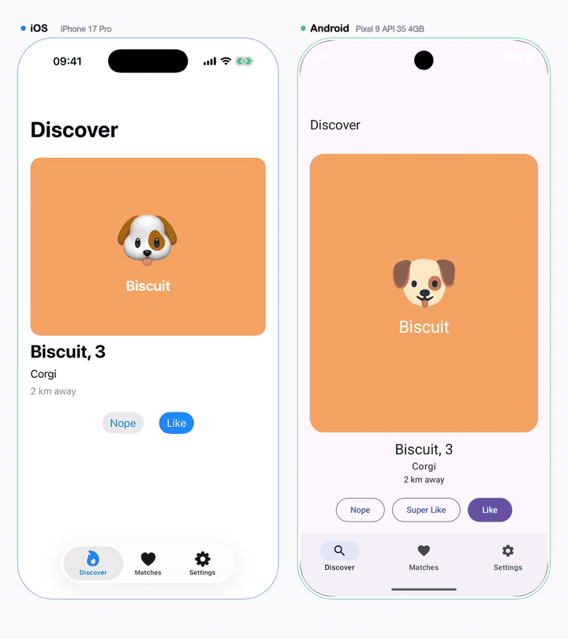

<p align="center"></p>

Find the behavioural differences between a native iOS app and its Android twin, and document each
one with a side-by-side video.

Built on [Argent](https://github.com/software-mansion/argent), Software Mansion's toolkit for
letting coding agents drive iOS simulators and Android emulators.

**How it works**

1. An agent explores both apps with the bundled skill and writes one short flow per feature.
2. crossmatch replays every flow on both devices in lockstep and records both screens.
3. After each step it diffs the two accessibility trees.
4. A judge decides which differences matter and which are platform idioms.
5. Each confirmed difference becomes a side-by-side video with callouts, and an HTML report.

**Demo** — a difference crossmatch found and documented in the bundled Dog Tinder apps: iOS shows a
match dialog after liking, Android does not.

<p align="center"></p>

```bash
npx crossmatch init      # config (apps auto-detected), the agent skill, Argent — all in one
crossmatch doctor        # check the toolchain
crossmatch setup         # boot both devices, install both apps fresh
```

Then ask your coding agent to explore both apps; it writes one flow per feature and runs
`crossmatch compare`, which judges, renders the videos and writes `crossmatch-out/report/index.html`.

**Needs:** macOS · Node 20+ · Xcode and the Android SDK · ffmpeg with libx264 · Argent 0.25+ · Claude Code (for the judge)

**Read next**

| | |
|---|---|
| [`docs/USAGE.md`](docs/USAGE.md) | commands, configuration, flow syntax |
| [`skills/crossmatch/SKILL.md`](skills/crossmatch/SKILL.md) | what the agent does |
| [`docs/argent-notes.md`](docs/argent-notes.md) | Argent quirks crossmatch works around |
| [`fixtures/`](fixtures/) | the two Dog Tinder test apps |
